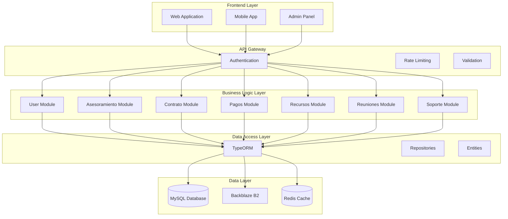
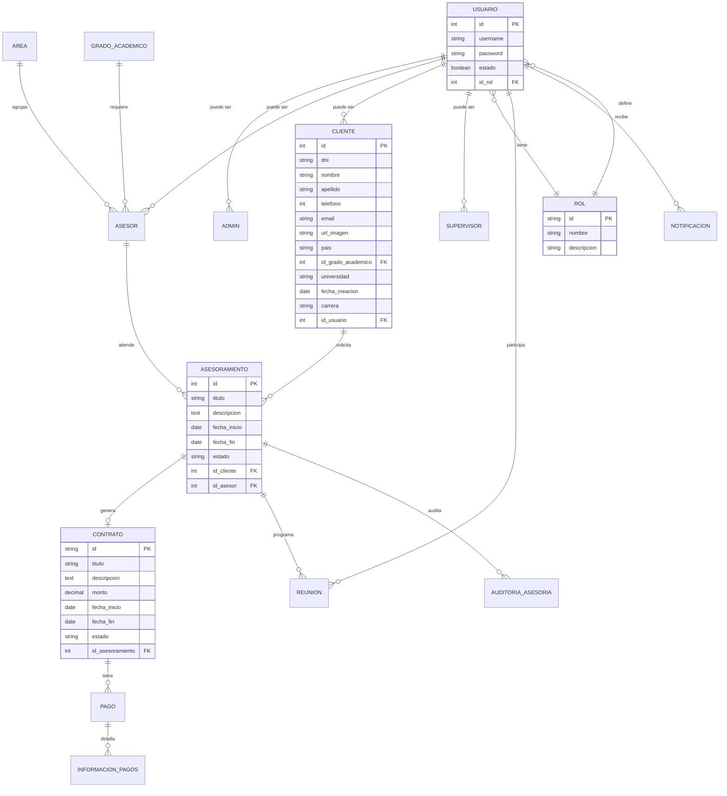
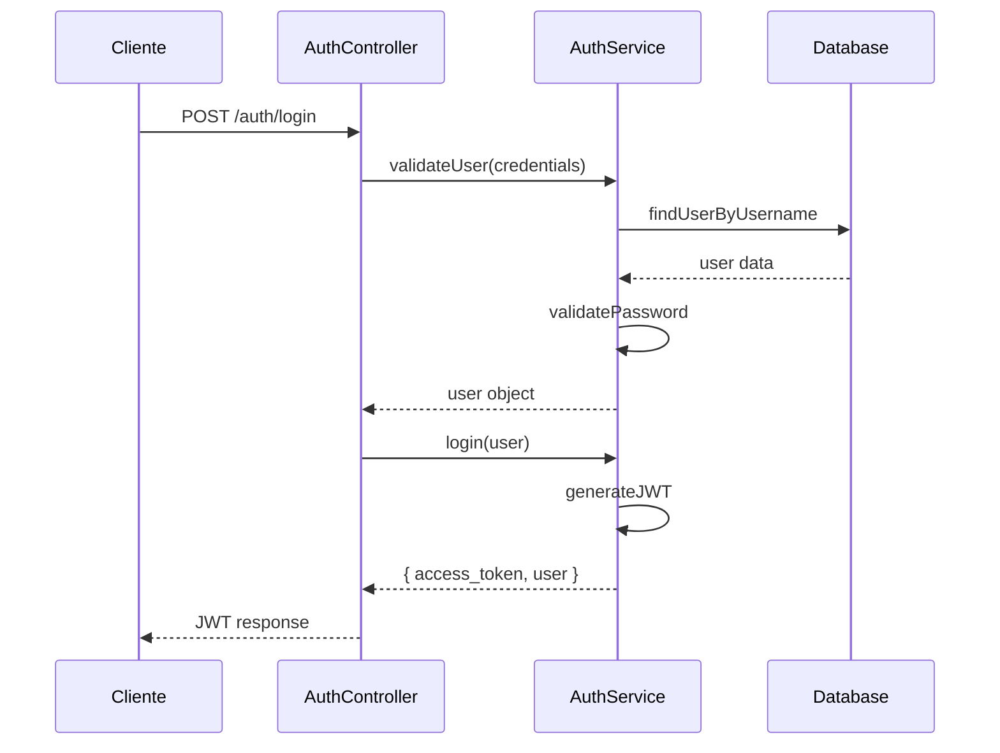
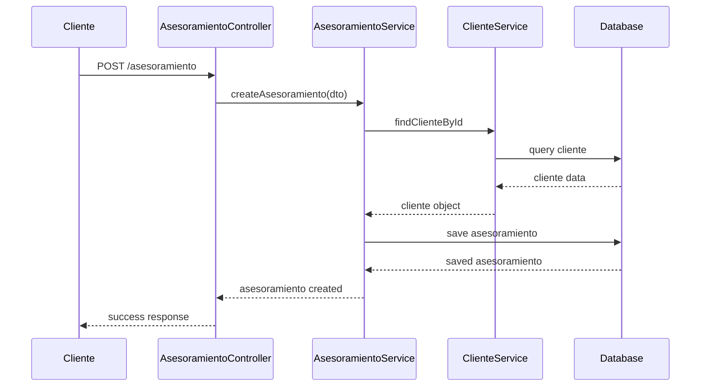

# 04. Diseño Técnico del Sistema

## 🎯 Visión General del Diseño

El diseño técnico del **BackendIntranet** está basado en principios de arquitectura limpia, patrones de diseño probados y mejores prácticas de desarrollo con NestJS y TypeScript.

## 🏗️ Diagramas de Arquitectura

### Diagrama de Componentes



### Diagrama de Entidades (ERD)



## 🔧 Tecnologías y Frameworks

### Stack Principal

#### Backend Framework
- **NestJS 11.x**: Framework principal de Node.js
- **TypeScript 5.x**: Lenguaje de programación
- **Node.js 18+**: Runtime de JavaScript

#### Base de Datos
- **MySQL 8.0**: Base de datos relacional principal
- **TypeORM 0.3.x**: ORM para TypeScript/JavaScript
- **Redis**: Cache en memoria (futuro)

#### Autenticación y Seguridad
- **Passport.js**: Middleware de autenticación
- **JWT**: JSON Web Tokens para autenticación
- **bcrypt**: Hashing de contraseñas
- **class-validator**: Validación de DTOs
- **class-transformer**: Transformación de objetos

#### Comunicación y APIs
- **Express.js**: Framework web subyacente
- **Socket.io**: Comunicación en tiempo real
- **Axios**: Cliente HTTP para APIs externas

#### Almacenamiento y Archivos
- **Backblaze B2**: Almacenamiento de archivos en la nube
- **Multer**: Middleware para carga de archivos
- **FFmpeg**: Procesamiento de archivos multimedia

#### Email y Notificaciones
- **Nodemailer**: Envío de emails
- **Handlebars**: Templates de email
- **@nestjs/schedule**: Tareas programadas

#### Testing y Calidad
- **Jest**: Framework de testing
- **Supertest**: Testing de APIs
- **ESLint**: Linter de código
- **Prettier**: Formateador de código

### Herramientas de Desarrollo

#### Contenedores
- **Docker**: Contenedorización
- **Docker Compose**: Orquestación de contenedores

#### Base de Datos
- **MySQL Workbench**: Administración de base de datos
- **TypeORM CLI**: Herramientas de migración

#### Monitoreo y Logs
- **Winston**: Sistema de logging (futuro)
- **Prometheus**: Métricas (futuro)

## 📊 Diseño de Base de Datos

### Estrategia de Naming

#### Convenciones de Nombres
- **Tablas**: snake_case (ej: `usuarios`, `asesoramientos`)
- **Columnas**: snake_case (ej: `fecha_creacion`, `id_usuario`)
- **Índices**: `idx_<tabla>_<columna>` (ej: `idx_usuarios_email`)
- **Foreign Keys**: `fk_<tabla>_<tabla_referenciada>` (ej: `fk_usuarios_rol`)

#### Tipos de Datos
- **IDs**: `INT AUTO_INCREMENT PRIMARY KEY`
- **Strings**: `VARCHAR(255)` para nombres, `TEXT` para descripciones
- **Fechas**: `DATETIME` para timestamps, `DATE` para fechas
- **Booleanos**: `BOOLEAN` o `TINYINT(1)`
- **Decimales**: `DECIMAL(10,2)` para montos monetarios

### Optimización de Consultas

#### Índices Estratégicos
```sql
-- Índices de búsqueda frecuente
CREATE INDEX idx_usuarios_email ON usuarios(email);
CREATE INDEX idx_usuarios_username ON usuarios(username);
CREATE INDEX idx_asesoramientos_estado ON asesoramientos(estado);
CREATE INDEX idx_asesoramientos_fecha ON asesoramientos(fecha_inicio);

-- Índices compuestos
CREATE INDEX idx_asesoramientos_cliente_estado ON asesoramientos(id_cliente, estado);
CREATE INDEX idx_pagos_contrato_fecha ON pagos(id_contrato, fecha_pago);
```

#### Estrategias de Consulta
- **Paginación**: LIMIT/OFFSET para listados grandes
- **Lazy Loading**: Carga diferida de relaciones
- **Query Builder**: Consultas complejas optimizadas
- **Caching**: Cache de consultas frecuentes

### Migraciones y Versionado

#### Estructura de Migraciones
```typescript
export class CreateUsersTable1234567890123 implements MigrationInterface {
  public async up(queryRunner: QueryRunner): Promise<void> {
    await queryRunner.createTable(
      new Table({
        name: 'usuarios',
        columns: [
          {
            name: 'id',
            type: 'int',
            isPrimary: true,
            isGenerated: true,
            generationStrategy: 'increment',
          },
          // ... más columnas
        ],
      }),
      true,
    );
  }

  public async down(queryRunner: QueryRunner): Promise<void> {
    await queryRunner.dropTable('usuarios');
  }
}
```

## 🔌 Diseño de APIs

### Patrones de Diseño de Endpoints

#### RESTful Design
```typescript
// Patrón estándar CRUD
GET    /api/v1/usuarios           // Listar usuarios
GET    /api/v1/usuarios/:id       // Obtener usuario específico
POST   /api/v1/usuarios           // Crear usuario
PUT    /api/v1/usuarios/:id       // Actualizar usuario completo
PATCH  /api/v1/usuarios/:id       // Actualizar usuario parcial
DELETE /api/v1/usuarios/:id       // Eliminar usuario
```

#### Endpoints Especializados
```typescript
// Endpoints de negocio específicos
POST   /api/v1/auth/login                    // Autenticación
POST   /api/v1/auth/forget-password          // Recuperación de contraseña
GET    /api/v1/asesoramiento/por-cliente/:id // Asesorías por cliente
POST   /api/v1/contratos/crear/:idAsesoramiento // Crear contrato
GET    /api/v1/calendario/asesor/:id         // Calendario de asesor
```

### DTOs (Data Transfer Objects)

#### Patrón de DTOs
```typescript
// DTO de entrada
export class CreateUsuarioDto {
  @IsString()
  @IsNotEmpty()
  username: string;

  @IsEmail()
  email: string;

  @IsString()
  @MinLength(8)
  password: string;

  @IsEnum(UserRole)
  role: UserRole;
}

// DTO de respuesta
export class UsuarioResponseDto {
  id: number;
  username: string;
  email: string;
  role: string;
  estado: boolean;
  fechaCreacion: Date;
}
```

#### Validaciones
```typescript
// Validaciones personalizadas
@IsString()
@Length(8, 20)
@Matches(/^(?=.*[a-z])(?=.*[A-Z])(?=.*\d)/, {
  message: 'La contraseña debe contener al menos una mayúscula, una minúscula y un número'
})
password: string;
```

### Manejo de Errores

#### Estructura de Respuesta de Error
```typescript
interface ErrorResponse {
  statusCode: number;
  message: string | string[];
  error: string;
  timestamp: string;
  path: string;
}
```

#### Códigos de Estado HTTP
- **200**: OK - Operación exitosa
- **201**: Created - Recurso creado
- **400**: Bad Request - Error de validación
- **401**: Unauthorized - No autenticado
- **403**: Forbidden - Sin permisos
- **404**: Not Found - Recurso no encontrado
- **409**: Conflict - Conflicto de datos
- **500**: Internal Server Error - Error del servidor

## 🔐 Diseño de Seguridad

### Autenticación JWT

#### Estructura del Token
```typescript
interface JWTPayload {
  sub: number;        // ID del usuario
  username: string;   // Nombre de usuario
  role: string;       // Rol del usuario
  iat: number;        // Fecha de emisión
  exp: number;        // Fecha de expiración
}
```

#### Configuración de Seguridad
```typescript
// Configuración JWT
const jwtConfig = {
  secret: process.env.JWT_SECRET,
  expiresIn: '24h',
  refreshExpiresIn: '7d',
};

// Rate limiting
const throttleConfig = {
  ttl: 60,      // 60 segundos
  limit: 10,    // 10 peticiones por minuto
};
```

### Control de Acceso (RBAC)

#### Roles y Permisos
```typescript
enum Permission {
  // Usuarios
  CREATE_USER = 'create:user',
  READ_USER = 'read:user',
  UPDATE_USER = 'update:user',
  DELETE_USER = 'delete:user',
  
  // Asesorías
  CREATE_ASESORAMIENTO = 'create:asesoramiento',
  READ_ASESORAMIENTO = 'read:asesoramiento',
  UPDATE_ASESORAMIENTO = 'update:asesoramiento',
  
  // Contratos
  CREATE_CONTRATO = 'create:contrato',
  READ_CONTRATO = 'read:contrato',
  UPDATE_CONTRATO = 'update:contrato',
}

// Mapeo de roles a permisos
const rolePermissions = {
  [UserRole.ADMIN]: Object.values(Permission),
  [UserRole.ASESOR]: [
    Permission.READ_ASESORAMIENTO,
    Permission.UPDATE_ASESORAMIENTO,
    Permission.CREATE_CONTRATO,
  ],
  [UserRole.ESTUDIANTE]: [
    Permission.READ_ASESORAMIENTO,
  ],
};
```

## 📁 Estructura de Archivos

### Organización de Módulos
```
src/
├── auth/                    # Módulo de autenticación
│   ├── dto/                # DTOs de autenticación
│   ├── guards/             # Guards de seguridad
│   ├── strategies/         # Estrategias de Passport
│   ├── auth.controller.ts
│   ├── auth.service.ts
│   └── auth.module.ts
├── usuario/                # Módulo de usuarios
│   ├── dto/                # DTOs de usuario
│   ├── usuario.entity.ts
│   ├── usuario.controller.ts
│   ├── usuario.service.ts
│   └── usuario.module.ts
├── asesoramiento/          # Módulo de asesorías
│   ├── dto/                # DTOs de asesoría
│   ├── entities/           # Entidades específicas
│   ├── asesoramiento.controller.ts
│   ├── asesoramiento.service.ts
│   └── asesoramiento.module.ts
├── common/                 # Módulo común
│   ├── entidades/          # Entidades compartidas
│   ├── guards/             # Guards compartidos
│   ├── pipes/              # Pipes personalizados
│   └── interceptors/       # Interceptors
├── entities.ts             # Exportación de entidades
├── app.module.ts           # Módulo principal
└── main.ts                 # Punto de entrada
```

### Convenciones de Naming

#### Archivos
- **Controllers**: `*.controller.ts`
- **Services**: `*.service.ts`
- **Entities**: `*.entity.ts`
- **DTOs**: `create-*.dto.ts`, `update-*.dto.ts`
- **Modules**: `*.module.ts`

#### Clases
- **Controllers**: `*Controller`
- **Services**: `*Service`
- **Entities**: `*Entity`
- **DTOs**: `Create*Dto`, `Update*Dto`

## 🔄 Flujos de Datos

### Flujo de Autenticación


### Flujo de Creación de Asesoría


## 🧪 Estrategias de Testing

### Testing Unitario
```typescript
describe('AuthService', () => {
  let service: AuthService;
  let userRepository: Repository<Usuario>;

  beforeEach(async () => {
    const module: TestingModule = await Test.createTestingModule({
      providers: [
        AuthService,
        {
          provide: getRepositoryToken(Usuario),
          useValue: mockUserRepository,
        },
      ],
    }).compile();

    service = module.get<AuthService>(AuthService);
    userRepository = module.get<Repository<Usuario>>(getRepositoryToken(Usuario));
  });

  it('should validate user credentials', async () => {
    const result = await service.validateUser('test@test.com', 'password');
    expect(result).toBeDefined();
  });
});
```

### Testing de Integración
```typescript
describe('AuthController (e2e)', () => {
  let app: INestApplication;

  beforeEach(async () => {
    const moduleFixture: TestingModule = await Test.createTestingModule({
      imports: [AppModule],
    }).compile();

    app = moduleFixture.createNestApplication();
    await app.init();
  });

  it('/auth/login (POST)', () => {
    return request(app.getHttpServer())
      .post('/auth/login')
      .send({ username: 'test', password: 'password' })
      .expect(200)
      .expect((res) => {
        expect(res.body.access_token).toBeDefined();
      });
  });
});
```

## 📈 Monitoreo y Logging

### Estructura de Logs
```typescript
interface LogEntry {
  timestamp: string;
  level: 'info' | 'warn' | 'error' | 'debug';
  message: string;
  context?: string;
  userId?: number;
  requestId?: string;
  metadata?: Record<string, any>;
}
```

### Métricas Clave
- **Performance**: Tiempo de respuesta, throughput
- **Errors**: Tasa de errores, tipos de errores
- **Business**: Usuarios activos, asesorías creadas
- **System**: Uso de CPU, memoria, disco

## 🔧 Configuración y Variables de Entorno

### Variables de Entorno Críticas
```env
# Database
DB_HOST=localhost
DB_PORT=3306
DB_USERNAME=root
DB_PASSWORD=password
DB_NAME=alejandria

# JWT
JWT_SECRET=your-secret-key
JWT_EXPIRES_IN=24h

# Email
GMAIL=your-email@gmail.com
GMAIL_PASSWORD=your-app-password

# Backblaze B2
B2_KEY_ID=your-key-id
B2_APP_KEY=your-app-key
BUCKET_ID=your-bucket-id
BUCKET_NAME=your-bucket-name
```

### Configuración por Ambiente
- **Development**: Configuración local con hot-reload
- **Staging**: Configuración de pruebas con datos de prueba
- **Production**: Configuración optimizada con logging completo
